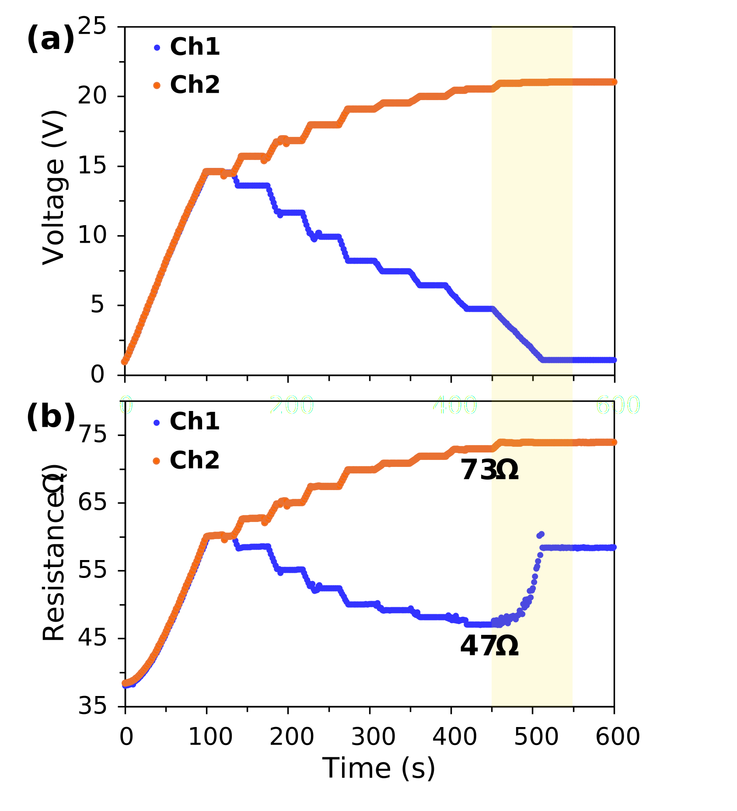

# Overview
This Python-based resistance feedback control system provides automated voltage regulation for single channel or multichannel control.   
The system continuously monitors resistances and adjusts voltages to maintain target resistances within a tolerance range and is able to run multiple feedback sequences. 

# System Architecture
The control system consists of two main functions that work together:

## 1. feedback_loop()
Monitors microheater resistances and adjusts voltages to stabilise microheaters at defined target resistances through continuous feedback control.

## 2. series_feedback()
Executes multiple feedback loops in a sequential order, with each feedback loop exiting after a specified hold_duration  
If hold_duration = None, the feedback loop runs indefinitely until KeyBoard Interrupt.

# Control Algorithm
First, all channel(s) are checked if their resistance > fail_resistance (implemented for 24-channel 48V-1A system):   
and if true, the voltage of the channel(s) will be set to 0V and permanently excluded from further feedback control.  
Otherwise, the resistances of active channel(s) will be monitored for feedback control.  
If the active channel(s) resistance > target + tolerance,  
the respective voltage(s) will be decreased by the voltage_step  
If the active channel(s) resistance < target + tolerance,  
the respective voltage(s) will be increased by voltage_step  
Otherwise, the voltage(s) will be held constant  
The system then waits for update_time before next round of feedback control.

# Batch Update Optimisation
For the 24-channel 48V-1A system, voltage updates are only sent to Teensy 4.1 for channels requiring adjustment.  
Teensy 4.1 communicates with DACs in batch mode rather than sequentially to minimise communication overhead and ensure synchronised control across all channels.

# State Continuity Between Steps
Voltages: Last voltages from previous step become starting voltages for next step  
CSV logging: all steps append to same CSV file  
Real-time plots: plotting continues seamlessly across all steps  
Failed channels (implemented for 24-channel 48V-1A system): excluded for subsequent steps
